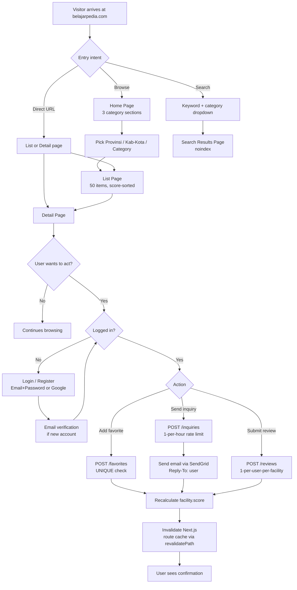
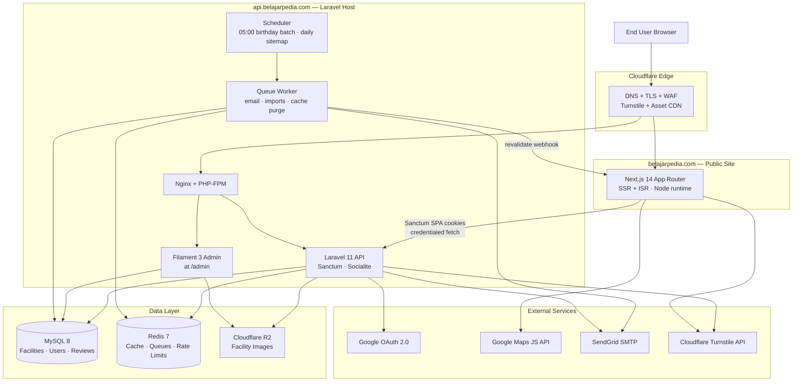

# Belajarpedia — Project Specification (v01)

**Project:** Belajarpedia — Educational Institution Directory for Indonesia
**Version:** 01
**Date:** 2026-04-28
**Owner:** Timedoor (Belajarpedia operations team)

---

## 1. Scope of Work

### 1.1 In Scope (MVP — v01)

**Public-facing site (Next.js)**
- Home page with three category sections (Sekolah, Universitas, Kursus), regional/category navigation, randomized "Rekomendasi" blocks, and a category-gated keyword search.
- Hierarchical list pages for all three categories, with `/page/{n}` pagination, server-rendered HTML, and 60-minute ISR caching.
- Detail pages per category with conditional sections (only display fields that exist), JSON-LD structured data, and breadcrumbs.
- Keyword search per category (`/{category}/search?q=...`), `noindex`, sitemap-excluded.
- Daily-regenerated `sitemap.xml`, `robots.txt`, canonical-tag policy, 404/410 handling.

**User account features (Laravel + Sanctum SPA cookies)**
- Email + password registration with verification email.
- Google OAuth login via Laravel Socialite.
- Profile management including children records (gender + birthdate).
- Favorites (cumulative, no undo, no count shown).
- Inquiry to facility (rate-limited to 1/hr/user/facility, sent via SendGrid with `Reply-To: user.email`, includes Timedoor Academy partnership footer).
- Review (★1–★5, one-time per user/facility, no re-rating, no comments, no public aggregate display).
- Birthday emails for user + each registered child (05:00 daily batch).

**Admin panel (Filament 3 inside Laravel, served at `api.belajarpedia.com/admin`)**
- Facility CRUD with category, region, score, status filters.
- Unified inquiry inbox (new-listing / correction / deletion / other) with status workflow.
- Kursus category management (add/edit/disable/delete with usage guards).
- Review moderation (delete-only, with synchronous score recalculation).
- User management with administrator-flag toggle.
- Excel bulk-import tool (upload → validate → preview → commit) with re-downloadable templates.
- Region master read-only browser.

**Data ingestion (MVP method)**
- XLSX bulk upload only. Single workbook, multi-sheet template (`sekolah`, `universitas`, `kursus`, `kursus_categories`, `regions_reference`, `README`).
- `name + address` exact-match dedup; UPDATE on match, INSERT on new, slug auto-generation with `-2/-3` collision handling, slug immutable post-creation.
- Status column drives soft delete; missing rows are NOT auto-deleted.

**SEO engine**
- Server-side meta title/description per page following the spec's templates.
- JSON-LD: `School` / `CollegeOrUniversity` / `EducationalOrganization` per detail page.
- BreadcrumbList JSON-LD on every list and detail page.
- Self-referencing canonicals on pagination; no canonical on detail pages.
- `noindex` on search results and zero-result list pages.

**Score engine**
- `score = inquiries_count * 3 + favorites_count + review_score_total`, persisted physical column, recalculated synchronously on every triggering event (review create/delete, inquiry, favorite, admin edit).
- Kursus list and home Rekomendasi: Timedoor facilities (`is_timedoor_academy = true`) forced to top / fixed slot.

**Caching**
- 60-minute ISR on all list, detail, and keyword-search pages.
- Home page Rekomendasi blocks fetched client-side, bypassing cache.
- Per-route revalidation triggered by Laravel after any score-affecting write.

### 1.2 Out of Scope (explicitly confirmed)

- Paid listings, ad management, monetization features.
- External / public API for third-party consumption.
- Multi-language support (site is Bahasa Indonesia only; admin in English/ID).
- Public review comments, public review feed, average-rating display, ranking pages.
- User-side editing of facility data.
- Active scraping / crawling pipeline (deferred to Phase 2; staging table is provisioned so the future scraper can plug in without schema changes).
- Mobile native apps.
- Real-time notifications, in-app messaging.
- Payments, subscriptions, e-commerce.

---

## 2. Tech Stack

| Layer | Technology | Notes |
|---|---|---|
| Frontend | **Next.js 14+ (App Router), React 18, TypeScript, Tailwind CSS** | SSR for SEO-critical routes; ISR with `revalidate: 3600`; Server Components by default; client components only for interactive widgets. |
| Frontend hosting | **AWS shared host (EC2 or Lightsail container)** | Single environment co-locating Next.js Node server with the Laravel host. Cloudflare in front for TLS + CDN. |
| Backend | **Laravel 11, PHP 8.3** | RESTful JSON API; Sanctum for SPA cookie auth; Socialite for Google OAuth; Filament 3 admin panel mounted at `/admin`. |
| Backend hosting | **AWS shared host (same EC2 as Next.js or paired instance)** | Nginx fronting PHP-FPM and Next.js; private subnet for DB. |
| Database | **MySQL 8** (RDS or self-managed on the same host) | InnoDB; UTF-8 mb4. |
| Cache & queues | **Redis 7** | Application cache, queue driver for Laravel jobs (email, cache invalidation, import processing), rate-limit counters. |
| Image storage | **Cloudflare R2** (S3-compatible) | Public bucket behind Cloudflare; `image_main` stores R2 object key; rendered through `next/image` with a custom loader. Hotlinking blocked at R2 + Cloudflare. |
| Auth | **Email + password** (Laravel built-in + bcrypt) and **Google OAuth 2.0** (Socialite) | Sanctum SPA cookies on `.belajarpedia.com`. |
| Email | **SendGrid SMTP** | Transactional provider; `From: noreply@belajarpedia.com`, `Reply-To: <user.email>` on inquiries; failed-send logs persisted. |
| Maps | **Google Maps JavaScript API + Places (read-only)** | Detail page map only when `latitude`/`longitude` present; key restricted by HTTP referrer to `belajarpedia.com`. |
| BOT protection | **Cloudflare Turnstile** | Mounted on register, login, inquiry submit, review submit, and the public registration/deletion-request forms. |
| CDN / Edge / TLS | **Cloudflare** | DNS, TLS, WAF, Turnstile, asset caching. ISR HTML cached at Next.js layer (not Cloudflare) for fine-grained per-route purge. |
| Monitoring | **Laravel Telescope (staging only)**, **Sentry** (frontend + backend), **CloudWatch** (host metrics) | |
| CI/CD | **GitHub Actions** | Lint + Pest + Playwright on PR; deploy on tag to AWS via SSH/rsync. |

---

## 3. Application Flow



---

## 4. Technical Architecture



---

## 5. Functional Requirements

### 5.1 Public site
- Render hierarchical list pages for `sekolah`, `universitas`, and `kursus` matching every URL pattern in the requirements (root, provinsi, kabkota, kecamatan, school_type/category-slug, plus shortened sekolah forms).
- Render category-specific detail pages following the URL templates and conditionally show map (Google Maps), description, address, contact, and category-specific attribute sections.
- Output meta title, meta description, and JSON-LD per the templates in the requirements doc.
- Output BreadcrumbList JSON-LD and visible breadcrumb UI on every list and detail page.
- Generate `sitemap.xml` once per day; `lastmod` only updates when underlying data changes; exclude removed facilities, deleted-category list pages, search pages, and zero-result list pages.
- Return `404` for non-existent URLs and deleted-category URLs; return `410 Gone` for facilities with `status = removed`.
- Pagination via `/page/{n}` (n ≥ 2) when total results ≥ 51; 50 items per page; self-referencing canonical on each pagination page.
- `noindex` on keyword-search result pages and zero-result list pages.

### 5.2 Search
- Per-category keyword search (no cross-category) at `/sekolah/search`, `/universitas/search`, `/kursus/search`.
- AND-style LIKE search across `name`, `address`, `description`.
- Same sort order as list pages (score DESC, name ASC; Timedoor pinned-top for kursus).
- `?page=2` (or `/page/2`) pagination, 50/page.

### 5.3 User account
- Register with: email, full name, gender (male/female), birthdate, phone, provinsi, kabkota, number of children, per-child gender + birthdate.
- Password rule: ≥8 chars, mixed-case + symbol; bcrypt-hashed.
- Email verification gate before login is permitted.
- Google OAuth login (creates user record on first sign-in if email not present; binds to existing record if email matches).
- Profile edit for all fields; email change requires re-verification.

### 5.4 Favorites
- Add-only (insert with `UNIQUE(user_id, facility_id)`); cannot be undone.
- Favorites count not surfaced in any UI.
- Login required.

### 5.5 Inquiries
- Form visible only when facility has an `email`.
- Login required; rate-limited to 1 per (user, facility) per rolling hour using Redis.
- Email body includes user's subject + message + Timedoor Academy partnership footer.
- Saved to `inquiries` table; never displayed to the user post-send.

### 5.6 Reviews
- ★1–★5 only; no decimals; no comment field.
- One per `(user_id, facility_id)`, enforced by UNIQUE constraint; no re-rating.
- Login required.
- Aggregate values, other users' ratings, average, and counts are NEVER displayed publicly; only the current user's existing rating (if any).
- Score points: ★1=0, ★2=0, ★3=1, ★4=2, ★5=3.

### 5.7 Birthday emails
- Daily 05:00 batch; targets are users whose `birthdate` matches today (M-D), and `user_children` whose `birthdate` matches today.
- One log row per send in `birthday_mail_logs` (idempotent — re-running for the same date does not re-send).
- No on-screen indication.

### 5.8 Admin panel
- Authentication via separate `is_admin` flag on `users`; non-admins receive 403 on `/admin`.
- Facility list with filters (name LIKE, category, provinsi, kabkota, status).
- Facility editor exposes all fields except `slug`; category-specific fields conditioned on `category`.
- Inquiry inbox unifies new-listing / correction / deletion / other; status workflow: Unprocessed → In Progress → Done | Rejected.
- Kursus category management with add/edit-name/disable/delete; delete blocked when any facility uses the category as `main` or `sub`.
- Review moderation: delete only; on delete, recalculate `review_score_total`, `review_count`, and `score`.
- Excel import page with three-step flow (upload → validate → commit) and a "Download current data" export of the same template.

### 5.9 Excel import
- XLSX accepted; sheets: `sekolah`, `universitas`, `kursus`, `kursus_categories`, `regions_reference` (read-only), `README`.
- Server validates: required fields, dropdown values, region slug resolution, email/URL format, lat/long range, image URL reachable (HEAD check, optional).
- Preview report shows New / Updated / Errors with downloadable error CSV.
- Commit step queues an import job; admin notified on completion.
- Slug auto-generated on insert with collision suffix; immutable on update.
- `status = removed` rows soft-delete (return 410 publicly); blank status remains active.

### 5.10 Score & cache invalidation
- Synchronous score recalculation on review CRUD, inquiry create, favorite create, admin edit affecting any score input, or facility status change.
- After every score change, dispatch a queued purge job that calls Next.js `revalidatePath()` for the affected detail page and its parent list pages.

---

## 6. Non-Functional Requirements

### 6.1 Performance
- TTFB ≤ 600ms for cached list/detail pages; full render ≤ 3s on a typical Indonesian residential connection.
- p95 API latency ≤ 400ms for read endpoints, ≤ 800ms for write endpoints (excluding outbound email).
- Designed for tens of thousands of facilities and hundreds of thousands of reviews/favorites.
- Mandatory indexes: `facilities(category)`, `facilities(province_id)`, `facilities(kabkota_id)`, `facilities(kecamatan_id)`, `facilities(score)`, `facilities(status)`, `facility_kursus_categories(kursus_category_id)`, `reviews(facility_id)`, `reviews(user_id)`, `favorites(facility_id)`, `inquiries(facility_id, user_id, created_at)` for rate-limit checks.
- Score is a physical column, never recomputed from JOINs at read time.

### 6.2 Security
- HTTPS-only (Cloudflare TLS + HSTS preload).
- CSRF protection via Sanctum on all state-changing endpoints.
- Eloquent + parameterized queries throughout (no raw SQL with concatenation).
- All user input escaped on output; React's default escaping plus Laravel Blade `{{ }}` for admin templates.
- Passwords stored bcrypt-hashed; minimum length 8 with character-class requirement.
- Google OAuth tokens never exposed to the frontend; stored encrypted at rest in `users` table.
- Rate limits enforced at Laravel: 1 inquiry/hour/user/facility, 5 login attempts/15min/IP, 10 review attempts/day/user.
- Cloudflare Turnstile required on register, login, inquiry submit, review submit, public registration form, public deletion request form.

### 6.3 Scalability
- Stateless Next.js; horizontally scalable behind ALB.
- Stateless Laravel API; horizontally scalable; Redis is the only shared session/cache store.
- DB connection pooling via PHP-FPM workers; read replica reserved for Phase 2.
- Score column avoids real-time aggregation; sitemap generation is a queued job; image transformations done by R2/Cloudflare on the fly.

### 6.4 Availability & Operations
- Target uptime 99.5% (excluding planned maintenance).
- Maintenance window publishable via a Cloudflare Worker showing a hold page.
- Daily MySQL backups (RDS automated, or `mysqldump` to R2 + 30-day retention).
- Failed email sends logged to `mail_logs` for post-hoc audit.
- Birthday batch idempotent: re-running on the same date is a no-op.

### 6.5 Data Protection & Privacy
- User PII (email, phone, birthdate, children) never exposed in public APIs.
- Inquiry content never published; visible only inside `mail_logs` for audit (admin-restricted).
- Internal-only fields (`score`, `*_count`) never returned in public API responses.
- Image hotlinking from external sites blocked at R2 + Cloudflare referrer rules.

### 6.6 SEO Compliance
- Server-rendered HTML for every public route (no client-only data dependency for meta or content).
- Sitemap regenerated daily; `lastmod` updated only on real data change.
- Canonical, `noindex`, 404, 410 policies match the requirements doc exactly.
- All slugs immutable post-creation; URL stability guaranteed.

---

## 7. List of Modules

```
01 — Public Web (Next.js)
   1.1 Home Page
       - Hero + SEO description block (fixed text)
       - Sekolah section: regional nav + Rekomendasi (8 random items, score≥10, client-fetched)
       - Universitas section: regional nav + Rekomendasi (8 random items, score≥10, client-fetched)
       - Kursus section: category nav + Rekomendasi (2 Timedoor + 6 general, client-fetched)
       - Keyword search bar with required category dropdown
   1.2 List Pages
       - Sekolah list (5 levels of hierarchy + school_type)
       - Universitas list (3 levels of hierarchy)
       - Kursus list (region × category combinations)
       - 50 items/page · /page/{n} pagination
       - Card: name, kab-kota, image only
   1.3 Detail Pages
       - Sekolah detail (school_type, accreditation, curriculum, biaya, jam, fasilitas)
       - Universitas detail (jenis, faculties_text, prodi_text, jalur_masuk, biaya, fasilitas)
       - Kursus detail (main + sub categories, program, usia, jadwal, biaya, fasilitas)
       - Conditional rendering: hide empty fields and empty sections
       - Google Maps embed when lat/long present
       - Inquiry form (when email present, login required)
       - Favorite button (login required)
       - Review widget (★1–5, login required)
   1.4 Search Pages
       - Per-category search (LIKE AND across name/address/description)
       - noindex, sitemap-excluded, self-canonical, 60-min cache
   1.5 SEO Engine
       - Meta title/description templates
       - JSON-LD: School / CollegeOrUniversity / EducationalOrganization
       - JSON-LD: BreadcrumbList
       - sitemap.xml daily
       - robots.txt
       - 404 / 410 handlers

02 — User Account (Next.js + Laravel)
   2.1 Registration (email+password, Google OAuth)
   2.2 Email verification flow
   2.3 Login / Logout (Sanctum SPA cookies)
   2.4 Profile editor (self + children CRUD)
   2.5 Email change verification
   2.6 Password reset flow

03 — Engagement Features (Laravel API)
   3.1 Favorites (add only, UNIQUE constraint, score impact)
   3.2 Inquiry submit (rate-limited, email dispatch via SendGrid)
   3.3 Review submit (UNIQUE constraint, score impact)
   3.4 Score recalculation engine

04 — Admin Panel (Filament 3)
   4.1 Admin authentication (is_admin flag)
   4.2 Facility management (list, search, edit, soft-delete)
   4.3 Inquiry inbox (unified form responses)
   4.4 Kursus category management (with usage guards)
   4.5 Review moderation (delete + recalc)
   4.6 User management
   4.7 Excel import tool (upload → validate → commit)
   4.8 Region master browser (read-only)
   4.9 Audit log (admin actions)

05 — Data Ingestion (MVP)
   5.1 XLSX template (multi-sheet)
   5.2 Validation engine (schema, region, dropdowns, uniqueness)
   5.3 Diff preview (New / Updated / Errors)
   5.4 Commit + queued import job
   5.5 Slug generation with collision handling
   5.6 Status-driven soft delete
   5.7 Current-data export (round-trip refresh)

06 — Email System (Laravel Queue + SendGrid)
   6.1 Verification email
   6.2 Email-change verification
   6.3 Password reset email
   6.4 Inquiry email (Reply-To: user, partnership footer)
   6.5 Birthday email (user + children, 05:00 batch)
   6.6 Mail log + retry policy

07 — Caching & Cache Invalidation
   7.1 Next.js ISR (60-min) for list/detail/search
   7.2 Home Rekomendasi: client-side fetch (cache bypass)
   7.3 Laravel revalidate-webhook on score / status change
   7.4 Sitemap regeneration scheduler

08 — Infrastructure & DevOps
   8.1 AWS shared host (Nginx + PHP-FPM + Node)
   8.2 MySQL 8 + Redis 7
   8.3 Cloudflare DNS / TLS / Turnstile / R2
   8.4 SendGrid SMTP
   8.5 GitHub Actions CI/CD
   8.6 Sentry + CloudWatch monitoring
   8.7 Daily MySQL backup to R2

09 — Phase 2 / Future (out of MVP scope)
   9.1 Active scraper pipeline (queued source jobs → staging table → existing import diff)
   9.2 Public API (rate-limited, key-gated)
   9.3 Read replica for analytics
   9.4 Mobile app (consume same API + Sanctum tokens instead of cookies)
```

---

## 8. Database Schema Reference

The schema follows the requirements doc exactly with these MVP additions:

- `facilities.latitude DECIMAL(10,7) NULL`
- `facilities.longitude DECIMAL(10,7) NULL`
- `users.is_admin BOOLEAN DEFAULT FALSE`
- `users.email_verified_at TIMESTAMP NULL`
- `users.google_id VARCHAR NULL UNIQUE`
- `mail_logs (id, mailable_type, recipient, subject, status, error, sent_at)` — for inquiry + birthday + verification audit
- `staging_facilities` mirroring `facilities` columns — used by the importer; left in place so a Phase 2 scraper can write to the same staging layer.

All other tables (`facilities`, `sekolah_details`, `universitas_details`, `kursus_details`, `kursus_categories`, `facility_kursus_categories`, `provinces`, `kabkota`, `kecamatan`, `users`, `user_children`, `favorites`, `inquiries`, `reviews`, `birthday_mail_logs`) match the requirements verbatim.

---

## 9. Excel Template Specification

**Filename:** `belajarpedia_facility_import_v1.xlsx`

| Sheet | Purpose | Notes |
|---|---|---|
| `README` | Instructions, dropdowns, examples | Read-only |
| `sekolah` | Sekolah facility rows | Columns listed below |
| `universitas` | Universitas facility rows | |
| `kursus` | Kursus facility rows | `sub_category_slugs` is comma-separated |
| `kursus_categories` | Master list of kursus categories | name, slug, is_active |
| `regions_reference` | Lookup for provinsi/kabkota/kecamatan slugs | Auto-populated by "Download regions" |

**Common facility columns:** `name`, `address`, `provinsi_slug`, `kabkota_slug`, `kecamatan_slug`, `email`, `phone`, `website`, `image_url`, `latitude`, `longitude`, `description`, `status` (active|removed), `is_timedoor_academy` (TRUE|FALSE).

**Sekolah-specific:** `school_type` (negeri|swasta|international), `accreditation`, `curriculum`, `biaya`, `jam_sekolah`, `fasilitas`.

**Universitas-specific:** `jenis` (Universitas|S1|S2|S3|D1-D4), `program_studi`, `jalur_masuk`, `biaya`, `fasilitas`, `faculties_text`, `prodi_text`.

**Kursus-specific:** `main_category_slug` (required), `sub_category_slugs` (optional, comma-separated), `program`, `usia`, `jadwal`, `biaya`, `fasilitas`.

**Update semantics:**
- Match key for diff: `(name, address)` exact match.
- Match found → UPDATE all columns except `slug`.
- No match → INSERT, generate slug.
- Missing rows → no action (rows must be explicitly marked `status=removed` to delete).
- All errors collected and downloadable as a CSV before the admin commits.
